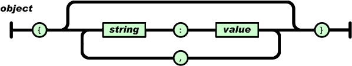

**JSON** (JavaScript Object Notation) is a lightweight data-interchange format. It is easy for humans to read and write. It is easy for machines to parse and generate. It is based on a subset of the JavaScript Programming Language, Standard ECMA-262 3rd Edition - December 1999. JSON is a text format that is completely language independent but uses conventions that are familiar to programmers of the C-family of languages, including C, C++, C#, Java, JavaScript, Perl, Python, and many others. These properties make JSON an ideal data-interchange language.

## Working with JSON
JSON is built on two structures:

- A collection of name/value pairs. In various languages, this is realized as an object, record, struct, dictionary, hash table, keyed list, or associative array.
- An ordered list of values. In most languages, this is realized as an array, vector, list, or sequence.
These are universal data structures. Virtually all modern programming languages support them in one form or another. It makes sense that a data format that is interchangeable with programming languages also be based on these structures.

In JSON, they take on these forms:

- An object is an unordered set of name/value pairs. An object begins with { (left brace) and ends with } (right brace). Each name is followed by : (colon) and the name/value pairs are separated by , (comma).




- An array is an ordered collection of values. An array begins with [ (left bracket) and ends with ] (right bracket). Values are separated by , (comma).


A value can be a string in double quotes, or a number, or true or false or null, or an object or an array. These structures can be nested.


A string is a sequence of zero or more Unicode characters, wrapped in double quotes, using backslash escapes. A character is represented as a single character string. A string is very much like a C or Java string.


A number is very much like a C or Java number, except that the octal and hexadecimal formats are not used.


Whitespace can be inserted between any pair of tokens. Excepting a few encoding details, that completely describes the language.

## JSON Schema
JSON Schema is a powerful tool for validating the structure of JSON data. However, learning to use it by reading its specification is like learning to drive a car by looking at its blueprints. You don’t need to know how an internal combustion engine fits together if all you want to do is pick up the groceries.

At its heart, JSON is built on the following data structures:

- object: `{ "key1": "value1", "key2": "value2" }`
- array: `[ "first", "second", "third" ]`
- number: `42, 3.1415926`
- string: `"This is a string"`
- boolean: `true, false`
- null: `null`

With these simple data types, all kinds of structured data can be represented. With that great flexibility comes great responsibility, however, as the same concept could be represented in myriad ways. For example, you could imagine representing information about a person in JSON in different ways:

```json
{
  "name": "George Washington",
  "birthday": "February 22, 1732",
  "address": "Mount Vernon, Virginia, United States"
}
```

```json
{
  "first_name": "George",
  "last_name": "Washington",
  "birthday": "1732-02-22",
  "address": {
    "street_address": "3200 Mount Vernon Memorial Highway",
    "city": "Mount Vernon",
    "state": "Virginia",
    "country": "United States"
  }
}
```

Both representations are equally valid, though one is clearly more formal than the other. The design of a record will largely depend on its intended use within the application, so there’s no right or wrong answer here. However, when an application says “give me a JSON record for a person”, it’s important to know exactly how that record should be organized. For example, we need to know what fields are expected, and how the values are represented. That’s where JSON Schema comes in. The following JSON Schema fragment describes how the second example above is structured.

```json
{
  "type": "object",
  "properties": {
    "first_name": { "type": "string" },
    "last_name": { "type": "string" },
    "birthday": { "type": "string", "format": "date-time" },
    "address": {
      "type": "object",
      "properties": {
        "street_address": { "type": "string" },
        "city": { "type": "string" },
        "state": { "type": "string" },
        "country": { "type" : "string" }
      }
    }
  }
}
```

You may have noticed that the JSON Schema itself is written in JSON. It is data itself, not a computer program. It’s just a declarative format for “describing the structure of other data”. This is both its strength and its weakness (which it shares with other similar schema languages). It is easy to concisely describe the surface structure of data, and automate validating data against it. However, since a JSON Schema can’t contain arbitrary code, there are certain constraints on the relationships between data elements that can’t be expressed. Any “validation tool” for a sufficiently complex data format, therefore, will likely have two phases of validation: one at the schema (or structural) level, and one at the semantic level. The latter check will likely need to be implemented using a more general-purpose programming language.

# References 

- [JSON](http://www.json.org/)
- [JSON Schema](http://json-schema.org/)
- [Understanding JSON Schema](https://spacetelescope.github.io/understanding-json-schema/)
